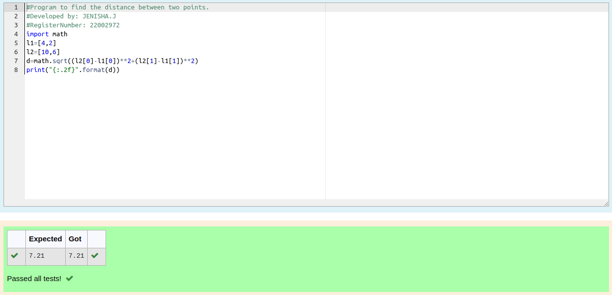

# DISTANCE-BETWEEN-TWO-POINTS

## AIM:
To write a python program to find the distance two points

## ALGORITHM:
### Step 1: 
Import the math module to use the built-in functions for calculation
### Step 2: 
Get the list of values from the user as input
### Step 3: 
Use built-in function math.sqrt() for calculating the distance between two points
### Step 4: 
Substitute the values in the distance formula  
### Step 5: 
Display the output
### PROGRAM:
  ```python
#Program to find the distance between two points.
#Developed by: JENISHA.J
#RegisterNumber: 22002972
import math
l1=[4,2]
l2=[10,6]
d=math.sqrt((l2[0]-l1[0])**2+(l2[1]-l1[1])**2)
print("{:.2f}".format(d))
```


### OUTPUT:


### RESULT:

Thus the distance between two points is successfully found by using python program.